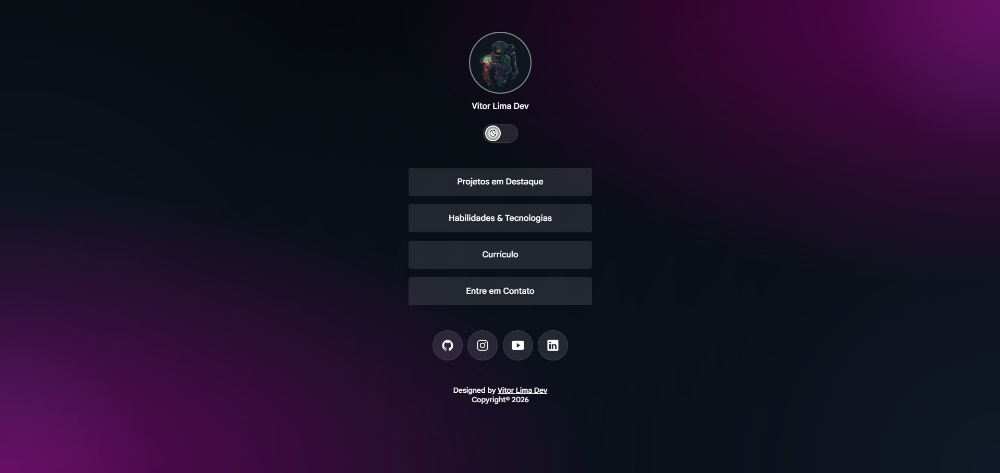
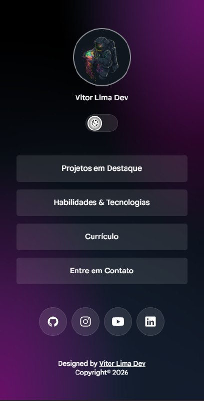

<h1 align="center">🔗 DevLinks 🔗</h1>
<p align="center">Designed by Vitor Lima Dev</p>

<br>

<div align="center">

  

  <br>

<strong>Uma página de links pessoal, moderna e responsiva, desenvolvida do zero com HTML, CSS e JavaScript.</strong>

  <br>

[](#)
[](#)
[](#)
[](#)

</div>

---

## ✨ Sobre o projeto

O **DevLinks — Vitor Lima Dev** é uma página de apresentação pessoal criada para reunir, em um único lugar, meus principais links profissionais, projetos, habilidades e formas de contato.

A proposta vai além de uma simples "link page": o projeto foi desenvolvido como uma oportunidade para praticar **estrutura semântica, responsividade, organização de CSS, manipulação do DOM e experiência visual**.

> 🎯 **Objetivo:** construir uma interface simples, elegante e funcional que represente minha identidade como desenvolvedor e sirva como ponto de entrada para meu portfólio.

---

## 🖥️ Preview

### Desktop


### Mobile



---

## 🎨 Interface

A identidade visual utiliza uma estética **dark / glassmorphism**, combinando:

- 🌌 Fundo escuro com gradientes radiais;
- 🟣 Tons de roxo e azul;
- 🪟 Elementos com aparência translúcida;
- 🔘 Botões com bordas e superfícies suaves;
- 🌗 Alternância entre tema claro e escuro;
- 📱 Layout adaptável para diferentes tamanhos de tela;
- 🎯 Hierarquia visual focada no conteúdo principal.

A interface foi pensada para manter o mesmo conceito visual tanto em **desktop quanto em dispositivos móveis**.

---

## 🚀 Funcionalidades

- [x] Perfil com avatar e identificação
- [x] Links para projetos em destaque
- [x] Área de habilidades e tecnologias
- [x] Link para currículo
- [x] Área de contato
- [x] Links para redes sociais
- [x] Alternância entre tema claro e escuro
- [x] Layout responsivo
- [x] Interface com efeitos visuais
- [x] Ícones para redes sociais
- [x] Estrutura preparada para expansão do portfólio

---

## 🛠️ Tecnologias utilizadas

| Tecnologia       | Utilização                                                  |
| ---------------- | ----------------------------------------------------------- |
| **HTML5**        | Estrutura e semântica da página                             |
| **CSS3**         | Layout, responsividade, temas, gradientes e efeitos visuais |
| **JavaScript**   | Interações e alternância de tema                            |
| **Google Fonts** | Tipografia da interface                                     |
| **Font Awesome** | Ícones das redes sociais                                    |
| **Git / GitHub** | Versionamento e publicação do projeto                       |

---

## 📂 Estrutura do projeto

```text
DEVLINK/
├── index.html
├── README.md
│
├── src/
│   ├── css/
│   │   ├── style.css
│   │   └── fonts.css
│   │
│   ├── js/
│   │   └── script.js
│   │
│   └── assets/
│       ├── avatar.png
│       ├── ...
│       └── icons/
│           ├── moon-stars.svg
│           └── ...
│
└── screenshots/
    ├── desktop-preview.jpg
    └── mobile-preview.jpg
```

> A estrutura acima representa a organização principal do projeto. Arquivos adicionais podem ser adicionados conforme o projeto evolui.

---

## 🌗 Sistema de temas

Um dos pontos centrais do projeto é o **Theme Switcher**.

A troca de tema é controlada pelo JavaScript e aplicada à interface através de classes e variáveis CSS, permitindo alterar elementos visuais sem duplicar toda a estrutura da página.

A utilização de **CSS Custom Properties (`--variavel`)** ajuda a centralizar valores importantes da interface, facilitando futuras alterações de identidade visual.

---

## 📱 Responsividade

O layout foi desenvolvido pensando em diferentes formatos de tela.

### Desktop

A interface utiliza o espaço disponível de forma mais ampla, mantendo o conteúdo principal centralizado.

### Mobile

Em telas menores, os elementos são reorganizados para preservar:

- legibilidade;
- espaçamento;
- área de toque dos botões;
- proporção dos elementos;
- experiência de navegação.

---

## 🧠 O que estou praticando com este projeto

Este projeto faz parte da minha evolução no desenvolvimento web e foi utilizado para colocar em prática conceitos como:

- HTML semântico;
- organização de classes;
- CSS moderno;
- Flexbox;
- responsividade;
- pseudo-classes;
- pseudo-elementos;
- CSS Custom Properties;
- gradientes;
- `backdrop-filter`;
- transições e animações;
- manipulação do DOM;
- `classList`;
- eventos em JavaScript;
- Git e GitHub;
- organização de projetos front-end.

---

## 👨‍💻 Desenvolvido por

<div align="center">

### Vitor Lima Dev

Desenvolvedor em formação, focado em **desenvolvimento web, UI/UX e tecnologia**.

---

<div align="center">

⭐ Se este projeto foi útil ou interessante para você, considere deixar uma estrela no repositório. ⭐

</div>
